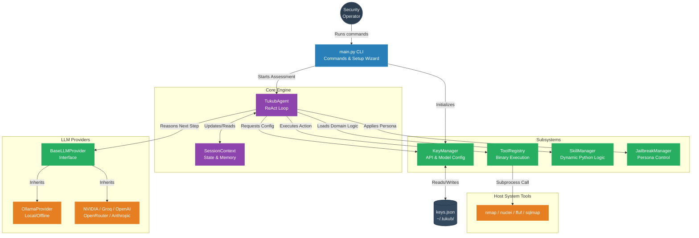
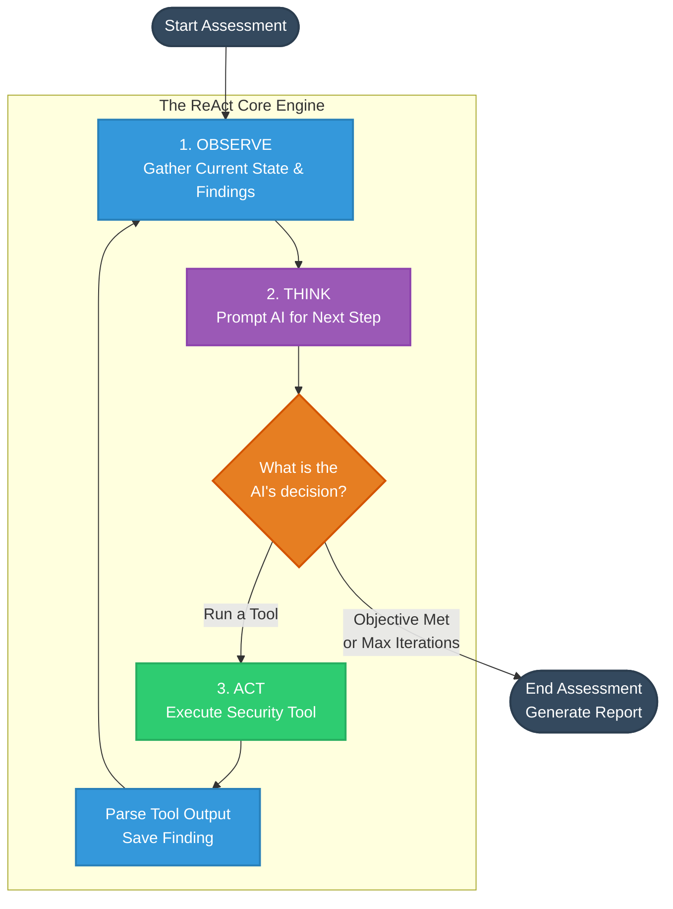

<div align="center">
  


  # TUKUB AI
  **Autonomous Security Agent**
  
  **Author:** A. HALIDDIN | **GitHub:** [Nasrif30](https://github.com/Nasrif30)
  
  *tukub (tə-ˈküb) - Tausug (Philippines) verb: to fight, to attack*
  <br>
  *"Like beasts fighting over territory, we hunt vulnerabilities"*
</div>

---

## Description
TUKUB AI is a terminal-based autonomous security agent for professional red team and blue team operations. Built on the ReAct (Reason-Act) pattern, the system acts as the "brain" that intelligently orchestrates over 50 industry-standard security tools based on dynamic observations.

### Features
- **ReAct Execution Engine**: Observe -> Think -> Act logic pattern.
- **50+ Security Tools**: Nmap, Nuclei, FFUF, SQLMap, BloodHound, and more.
- **Multi-LLM Support**: 
  - **Offline Mode**: Run completely privately using Local `Ollama` models.
  - **Cloud APIs**: NVIDIA, Groq, OpenRouter, HuggingFace, OpenAI, Anthropic.
- **Jailbreak System**: 8 integrated personas/methods for authorized testing.
- **Zero Context Waste**: Dynamically loads domain-specific skills only when needed.
- **Versatile Modes**: Dedicated modes for CTF, Red Teaming, and Blue Team/DFIR.
- **MCP Server**: Model Context Protocol support.

---

## Architecture & Execution Flow

GitHub natively renders these diagrams. TUKUB AI uses the following architecture to reason about targets and execute security assessments autonomously.

### Core Architecture



### The ReAct Execution Loop



---

## Installation
```bash
# Clone the repository
git clone https://github.com/Nasrif30/TUKUB-AI.git
cd TUKUB-AI

# Create virtual environment
python -m venv venv
source venv/bin/activate  # On Windows use: .\venv\Scripts\activate

# Install dependencies
pip install -r requirements.txt
```

## Commands & Usage

TUKUB AI provides a unified command-line interface.

### 1. Configuration & API Setup

Before running scans, you must configure an AI provider. TUKUB AI supports multiple providers, and keys are stored securely in `~/.tukub/keys.json`.

**Interactive Setup (Recommended)**
The easiest way to get started is the setup wizard:
```bash
python main.py setup
```

**Manual Configuration**
You can manually set keys and default models for any provider:
```bash
python main.py config set nvidia --key "YOUR_API_KEY" --model "deepseek-ai/deepseek-v4-pro"
python main.py config set groq --key "YOUR_API_KEY"
python main.py config set openai --key "YOUR_API_KEY"
```

**Check Provider Status**
Verify which providers are configured and working:
```bash
python main.py providers
```

### 2. Information & Discovery

**List Security Tools**
See all 50+ integrated tools that the AI can use:
```bash
python main.py tools
```

**List Agent Skills**
View the dynamic Python skills loaded by the agent:
```bash
python main.py skills
```

### 3. Running Assessments

You must explicitly provide authorization (e.g., a ticket number, "Owner", or written consent reference) to run an assessment.

**General Assessment (ReAct Loop)**
Run a standard autonomous scan:
```bash
python main.py run --target example.com --objective "Find vulnerabilities" --provider nvidia --authorization "AUTH-001" --output report.json
```

**CTF Mode**
Specifically tuned to hunt for flags (useful for HackTheBox, TryHackMe):
```bash
python main.py ctf --target ctf.example.com --flag-format "CTF{.*}" --provider groq
```

**Red Team Mode**
Aggressive, noisy, full-scope penetration testing mode:
```bash
python main.py redteam --target 10.10.10.5 --authorization "PENTEST-505"
```

**Blue Team / DFIR Mode**
Defensive mode for analyzing logs, memory dumps, or pcaps:
```bash
python main.py blueteam --target ./suspicious_memory.dmp --objective "Find malware"
```

### 4. Offline Mode
You can force TUKUB AI to run entirely offline using Local LLMs via Ollama. No data will leave your machine.
```bash
# Make sure Ollama is installed and running
ollama pull llama3

# Run the agent in offline mode
python main.py run --target 10.10.10.5 --objective "Scan ports" --offline --authorization "AUTH"
```

## Legal Disclaimer
TUKUB AI is strictly for authorized security testing and educational purposes. You must have explicit, written permission to test any targets. Unauthorized use is illegal.
