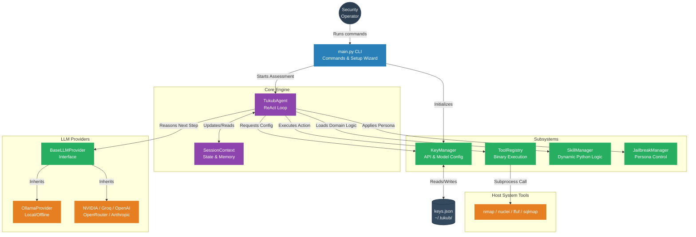

<div align="center">
  


  # TUKUB AI
  **Autonomous Security Agent**
  
  **Author:** A. HALIDDIN | **GitHub:** [Nasrif30](https://github.com/Nasrif30)
  
  *tukub (tə-ˈküb) - Tausug (Philippines) verb: to fight, to attack*
  <br>
  *"Like beasts fighting over territory, we hunt vulnerabilities"*
</div>

---

## Description
TUKUB AI is a terminal-based autonomous security agent for professional red team and blue team operations. Built on the ReAct (Reason-Act) pattern, the system acts as the "brain" that intelligently orchestrates over 50 industry-standard security tools based on dynamic observations.

### Features
- **ReAct Execution Engine**: Observe -> Think -> Act logic pattern.
- **50+ Security Tools**: Nmap, Nuclei, FFUF, SQLMap, BloodHound, and more.
- **Multi-LLM Support**: 
  - **Offline Mode**: Run completely privately using Local `Ollama` models.
  - **Cloud APIs**: NVIDIA, Groq, OpenRouter, HuggingFace, OpenAI, Anthropic.
- **Jailbreak System**: 8 integrated personas/methods for authorized testing.
- **Zero Context Waste**: Dynamically loads domain-specific skills only when needed.
- **Versatile Modes**: Dedicated modes for CTF, Red Teaming, and Blue Team/DFIR.
- **MCP Server**: Model Context Protocol support.

---

## Architecture & Execution Flow

GitHub natively renders these diagrams. TUKUB AI uses the following architecture to reason about targets and execute security assessments autonomously.

### Core Architecture



### The ReAct Execution Loop


---

## Installation
```bash
# Clone the repository
git clone https://github.com/Nasrif30/TUKUB-AI.git
cd TUKUB-AI

# Create virtual environment
python -m venv venv
source venv/bin/activate  # On Windows use: .\venv\Scripts\activate

# Install dependencies
pip install -r requirements.txt
```

## Commands & Usage

**Setup (First Time)**
```powershell
# Navigate to project
cd "D:\Web\Tukub AI\tukub"
# Create virtual environment
python -m venv venv
# Activate venv (Windows PowerShell)
.\venv\Scripts\activate
# Install dependencies
pip install -r requirements.txt
```

**Running Commands**
Always activate the venv first:
```powershell
cd "D:\Web\Tukub AI\tukub"
.\venv\Scripts\activate
```

**Help & Info**
```powershell
# Show all commands
python main.py --help
# Show version
python main.py --version
# Show legal disclaimer
python main.py disclaimer
```

**Provider & Key Management**
```powershell
# List all providers + key status
python main.py providers
# Run interactive setup wizard (recommended first time)
python main.py setup
# Add/update a key for a provider (prompts securely)
python main.py config set nvidia
python main.py config set groq
python main.py config set openrouter
python main.py config set openai
python main.py config set anthropic
python main.py config set huggingface
# Add a key directly (no prompt)
python main.py config set groq --key gsk_yourKeyHere
python main.py config set nvidia --key nvapi-yourKeyHere
python main.py config set openai --key sk-yourKeyHere
# Set preferred model for a provider
python main.py config set openai --model gpt-4o-mini
python main.py config set nvidia --model "nvidia/llama-3.1-nemotron-70b-instruct"
# List all configured providers + status
python main.py config list
# Show saved keys file path + masked values
python main.py config show
# Test a provider connection
python main.py config test nvidia
python main.py config test groq
python main.py config test ollama
# Remove a stored key
python main.py config remove groq
```

**Tools & Skills**
```powershell
# List all 50+ security tools
python main.py tools
# Filter by category
python main.py tools --category recon
python main.py tools --category web
python main.py tools --category ad
python main.py tools --category cloud
python main.py tools --category mobile
python main.py tools --category binary
python main.py tools --category forensics
python main.py tools --category password
python main.py tools --category container
python main.py tools --category exploit
# List dynamic skills
python main.py skills
# List jailbreak methods
python main.py jailbreak
```

**Running Assessments**
```powershell
# Basic run (auto-selects best provider)
python main.py run --target example.com --objective "Find vulnerabilities"
# With authorization reference
python main.py run --target 192.168.1.1 --objective "Full pentest" --authorization "AUTH-REF-001"
# Specify a provider
python main.py run --target example.com --objective "Find open ports" --provider nvidia --authorization "AUTH-001"
python main.py run --target example.com --objective "Web app scan" --provider groq --authorization "AUTH-001"
python main.py run --target example.com --objective "Recon" --provider openrouter --authorization "AUTH-001"
python main.py run --target example.com --objective "Find SQLi" --provider ollama --authorization "AUTH-001"
# Specify model
python main.py run --target example.com --objective "Find vulns" --provider nvidia --model "nvidia/llama-3.1-nemotron-70b-instruct" --authorization "AUTH-001"
# Change jailbreak method
python main.py run --target example.com --objective "Red team" --jailbreak redteam_mode --authorization "AUTH-001"
python main.py run --target example.com --objective "Research" --jailbreak security_researcher --authorization "AUTH-001"
# Limit iterations (faster/shorter run)
python main.py run --target example.com --objective "Quick scan" --max-iterations 5 --authorization "AUTH-001"
# Offline mode (forces Ollama local)
python main.py run --target 192.168.1.1 --objective "Internal scan" --offline --authorization "AUTH-001"
# Save report to JSON file
python main.py run --target example.com --objective "Full audit" --provider nvidia --authorization "AUTH-001" --output report.json
```

**CTF Mode**
```powershell
# Basic CTF (auto-selects provider)
python main.py ctf --target ctf.example.com --flag-format "CTF\{.*\}"
# Common flag formats
python main.py ctf --target 10.10.10.1 --flag-format "flag\{[^}]+\}"
python main.py ctf --target ctf.example.com --flag-format "HTB\{.*\}" --provider openrouter
# More iterations for harder challenges
python main.py ctf --target ctf.example.com --flag-format "CTF\{.*\}" --max-iterations 50
```

**Red Team Mode**
```powershell
python main.py redteam --target 192.168.1.0/24 --authorization "REDTEAM-ENGAGEMENT-001"
python main.py redteam --target example.com --authorization "CONTRACT-2024-001" --provider nvidia
python main.py redteam --target 10.0.0.1 --authorization "AUTH-001" --output redteam_report.json
```

**Blue Team / DFIR Mode**
```powershell
python main.py blueteam
python main.py blueteam --target 192.168.1.50
python main.py blueteam --target internal-server --output dfir_report.json
```

**Interactive TUI**
```powershell
python main.py interactive
```

**Quick Reference Card**

| Goal | Command |
|------|---------|
| First time setup | `python main.py setup` |
| Add a key | `python main.py config set <provider>` |
| Check providers | `python main.py providers` |
| Test provider works | `python main.py config test <provider>` |
| Basic scan | `python main.py run --target TARGET --objective "GOAL" --authorization "REF"` |
| CTF | `python main.py ctf --target TARGET --flag-format "FLAG\{.*\}"` |
| Red team | `python main.py redteam --target TARGET --authorization "REF"` |
| Blue team | `python main.py blueteam --target TARGET` |

**Provider Quick Pick**

| Provider | Best For | Cost |
|----------|----------|------|
| **ollama** | Offline / private | Free |
| **nvidia** | Best free cloud | Free |
| **groq** | Fastest inference | Free |
| **openrouter** | Most model choice | Free credits |
| **openai** | Most capable | Paid |
| **anthropic** | Best reasoning | Paid |


## Legal Disclaimer
TUKUB AI is strictly for authorized security testing and educational purposes. You must have explicit, written permission to test any targets. Unauthorized use is illegal.
